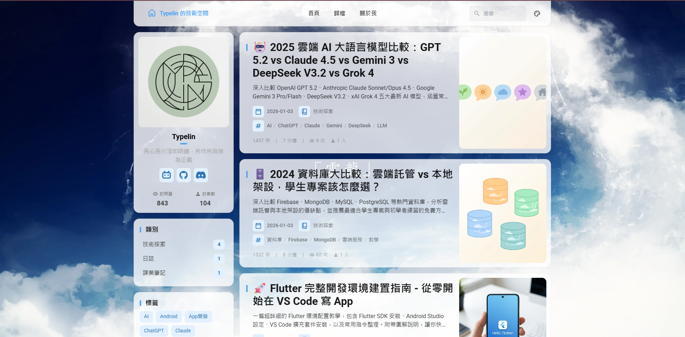

# Typelin 的技術空間



> 一個基於 Astro 構建的現代化個人部落格，專注於技術分享與實踐。

[](https://github.com/afoim/fuwari/blob/main/LICENSE)
[](https://pages.cloudflare.com/)

## ✨ 特色

- 🚀 基於 Astro 5.0+ 構建，效能卓越
- 📱 完全響應式設計，支援行動裝置
- 🌙 支援深色/淺色主題切換
- 📝 支援 Markdown 格式 + KaTeX 數學公式
- 🔍 內建搜尋功能
- 📊 文章閱讀時間統計
- 🏷️ 標籤和分類系統
- 📈 SEO 優化
- 📡 邊緣計數系統 (Cloudflare Workers + D1)
- 🖼️ 隨機背景圖 API 整合

---

## 🛠️ 技術棧

| 分類 | 技術 |
|------|------|
| 框架 | Astro 5.x |
| 樣式 | Tailwind CSS |
| 互動 | Svelte |
| 部署 | Cloudflare Pages |
| 計數 | Cloudflare Workers + D1 |
| 動畫 | Swup.js |
| 程式碼高亮 | Expressive Code |

---

## 🚀 部署指南

### 1. Fork 專案

```bash
git clone https://github.com/Typelin/fuwari.git
cd fuwari
npm install
```

### 2. 本地開發

```bash
npm run dev
```

### 3. 部署到 Cloudflare Pages

1. 登入 [Cloudflare Dashboard](https://dash.cloudflare.com/)
2. 進入 **Workers & Pages** → **Create** → **Pages**
3. 連接 GitHub 儲存庫
4. 設定：
   - **Build command**: `npm run build`
   - **Build output directory**: `dist`
   - **Node.js version**: `18` 或以上
5. 點擊 Deploy

### 4. 自訂域名

在 Cloudflare Pages 設定中添加自訂域名，並確保 DNS 已正確指向。

---

## � 相較於原版的改動

本專案基於 [saicaca/fuwari](https://github.com/saicaca/fuwari) 和 [afoim/fuwari](https://github.com/afoim/fuwari)，進行了以下客製化：

### 配置變更 (`src/config.ts`)

| 項目 | 原版 | 本專案 |
|------|------|--------|
| 網站標題 | Fuwari | Typelin Blog |
| 語言 | en | zh_TW (繁體中文) |
| Banner | 啟用 | 停用 |
| 隨機背景圖 | 無 | 啟用 (`pic.acofork.com`) |
| 官方網站彈窗 | 啟用 | 停用 |
| Umami 統計 | 啟用 | 停用 (改用 CF Workers) |

### 新增功能

- **Cloudflare Workers 計數器**: 自建邊緣計數系統，使用 D1 資料庫
- **隨機背景圖**: 整合 `pic.acofork.com` API
- **Discord 複製功能**: 點擊 Discord 圖示複製用戶名
- **KaTeX 數學公式**: 支援 LaTeX 語法

### UI 調整

- 側邊欄類別與標籤組件樣式
- 回到頂部按鈕支援移動端
- 頁腳資訊客製化
- 文章授權聲明區塊

---

## �📁 專案結構

```
├── public/                 # 靜態資源
│   ├── images/             # 圖片資源
│   ├── favicon/            # 網站圖示
│   └── _redirects          # Cloudflare 重定向規則
├── src/
│   ├── components/         # Astro/Svelte 元件
│   ├── content/
│   │   ├── posts/          # 部落格文章 (Markdown)
│   │   └── assets/         # 文章內嵌圖片
│   ├── layouts/            # 頁面佈局
│   ├── pages/              # 路由頁面
│   ├── plugins/            # Remark/Rehype 插件
│   └── config.ts           # 網站配置
├── astro.config.mjs        # Astro 配置
└── package.json
```

---

## ⚠️ 注意事項

### 部署前必做

1. **修改 `astro.config.mjs`**:
   ```js
   site: "https://你的域名.com",
   ```

2. **修改 `src/config.ts`**:
   - 更新 `siteConfig.title`、`subtitle`、`description`
   - 更新 `profileConfig` 中的個人資訊
   - 更新 `cfCounterUrl` 為你的 Workers URL (如有使用)

3. **清理範例文章**:
   - 刪除 `src/content/posts/` 中的範例文章
   - 添加你自己的文章

### Workers 計數器 (可選)

如需使用邊緣計數功能，需另外部署 Cloudflare Workers：

1. 創建 D1 資料庫
2. 部署 Workers 腳本
3. 在 `src/config.ts` 設定 `cfCounterUrl`

---

## 🙏 特別感謝

本專案的誕生離不開以下開源專案的支持：

- [saicaca/fuwari](https://github.com/saicaca/fuwari) - 優秀的 Astro 部落格模板
- [afoim/fuwari](https://github.com/afoim/fuwari) - 提供邊緣計數實現思路

---

## 📄 授權

本專案採用 [MIT License](LICENSE) 授權。
