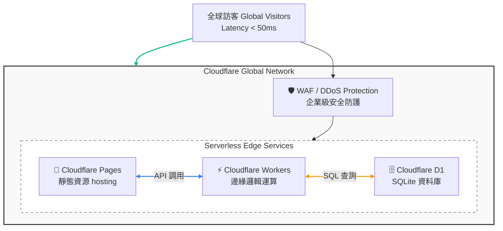

## 緣起：為什麼選擇 Fuwari？

在眾多靜態網站生成器 (Static Site Generators, SSG) 中，我最終選擇了 **Astro** 作為技術棧核心。

Astro 的 **Island Architecture（孤島架構）** 是一種革命性的渲染即，它允許我們在保持頁面核心為純靜態 HTML 的同時，僅在需要互動的區域（如評論區、計數器）按需載入 JavaScript。這對於部落格這類以內容為主的網站來說，是近乎完美的解決方案，能達到極致的首屏載入速度 (FCP)。

本站的基礎架構來自兩個重要的開源專案：

| 專案 | 貢獻 |
|------|------|
| [saicaca/fuwari](https://github.com/saicaca/fuwari) | 原始 Astro 部落格模板，提供了極簡美學的設計基礎 |
| [afoim/fuwari](https://github.com/afoim/fuwari) | 繁體中文化版本，提供了在地化的介面文字與部分功能優化 |

在這兩個版本的基礎上，我進行了大量的客製化改造，打造出現在這個獨一無二的技術空間。

---

## 技術架構概覽

整體架構採用現代 **JAMstack** 理念，將前端展示、邏輯運算與資料儲存完全解耦，並充分利用 **Edge Computing (邊緣運算)** 的優勢。

| 層級 | 技術選型 | 說明 |
|------|---------|------|
| **前端框架** | Astro 5.x | 支援 SSG/SSR 混合模式，實現零 JS 預設載入 |
| **UI 框架** | Svelte + Tailwind CSS | 元件化開發、原子化樣式 |
| **內容管理** | Markdown + Content Collections | 類型安全的內容層 |
| **部署平台** | Cloudflare Pages | 全球邊緣網絡，自動 CI/CD |
| **資料儲存** | Cloudflare D1 (SQLite) | Serverless 關聯式資料庫 |
| **運算層** | Cloudflare Workers | 邊緣運算，毫秒級冷啟動 |

---

## 部署架構圖

本站部署於 Cloudflare 的全球邊緣網絡 (Global Network) 之上，利用其 Anycast 技術確保全球訪客都能連接到最近的資料中心。



---

## 主要改造內容與實踐細節

### 1. 視覺與品牌重塑

為了建立獨特的識別度，我對原始主題進行了深度的視覺定製。

<details>
<summary>點擊查看實作細節</summary>

- **個性化 Logo**：設計了專屬的幾何圖形標誌，並製作了 SVG 格式以適應不同解析度。
- **配色系統**：基於 `oklch` 色彩空間進行動態主題色調整。OKLCH 相比傳統的 RGB 或 HSL，能提供更符合人類感知的亮度一致性，在深色與淺色模式切換時更為自然。
- **動態背景**：整合第三方 API (`pic.acofork.com`) 實現每次訪問的隨機圖片背景，並利用 CSS `backdrop-filter` 增加毛玻璃質感。

</details>

### 2. 自研邊緣計數系統

放棄了傳統的第三方統計方案（如 Google Analytics、百度統計），自行基於 Cloudflare 全家桶開發了輕量級計數系統。這不僅保護了使用者隱私（無 Cookie），也避免了第三方腳本拖慢載入速度。

**系統架構設計：**

1.  **Frontend**: Astro 元件在頁面載入時發起非同步請求。
2.  **Middleware (Workers)**: 攔截請求，解析請求頭中的 IP 與 User-Agent。
3.  **Storage (D1)**: 執行 SQL 語句，更新訪問計數。

<details>
<summary>點擊查看 Workers 核心代碼邏輯</summary>

```typescript
// Worker 處理邏輯簡化版
export default {
  async fetch(request, env) {
    const url = new URL(request.url);
    const path = url.searchParams.get('path');
    const ip = request.headers.get('cf-connecting-ip');
    
    // 防作弊檢查：簡單的頻率限制
    if (await isRateLimited(env, ip)) {
       return new Response('Too Many Requests', { status: 429 });
    }

    // 更新 D1 資料庫
    await env.DB.prepare(
      `INSERT INTO visits (path, count) VALUES (?, 1)
       ON CONFLICT(path) DO UPDATE SET count = count + 1`
    ).bind(path).run();

    // 獲取最新計數
    const result = await env.DB.prepare(
      `SELECT count FROM visits WHERE path = ?`
    ).bind(path).first();

    return Response.json(result);
  }
}
```
</details>

**技術優勢：**
*   **全球邊緣部署**：利用 Cloudflare 的 300+ 邊緣節點，確保全球訪問低延遲。
*   **無 Cookie 設計**：完全基於客戶端指紋與 IP（經雜湊處理），符合 GDPR 規範。
*   **高併發處理**：Workers 的隔離技術使其能輕鬆應對瞬間高流量。

### 3. 構建與部署流程優化

採用 GitOps 流程，確保代碼變更的可追溯性與部署的自動化。

- **增量式構建**：Cloudflare Pages 檢測 Git commit，僅在內容變更時觸發構建。
- **資源壓縮**：構建過程中自動執行 gzip/brotli 壓縮，並對圖片進行 WebP 格式轉換。
- **快取策略**：靜態資源 (Images, CSS, JS) 設定長效快取 (Cache-Control: public, max-age=31536000)，HTML 頁面設定 `no-cache` 確保內容即時性。

---

## 結語

打造這個技術空間不僅是為了寫作，更是一次對現代 Web 技術的完整實踐。從前端的 Astro 孤島架構，到後端的邊緣運算，每一個環節的優化都讓我對「性能」與「體驗」有了更深的理解。

如果你也對這裡的技術細節感興趣，歡迎在 GitHub 上查看本站源碼，或透過下方的社交連結與我交流。

---

## 社交連結

歡迎在以下平台找到我，進行技術交流或閒聊：

| 平台 | ID / 連結 | 說明 |
|------|-----------|------|
| GitHub | [Typelin](https://github.com/Typelin) | 開源專案與代碼 |
| Bilibili | [Typelin 頻道](https://space.bilibili.com/383913921) | 技術分享影片 |
| Discord | `typelin#1109` | 點擊側面圖示即可複製 ID |
| QQ | `3825383356` | 點擊側面圖示即可複製號碼 |
